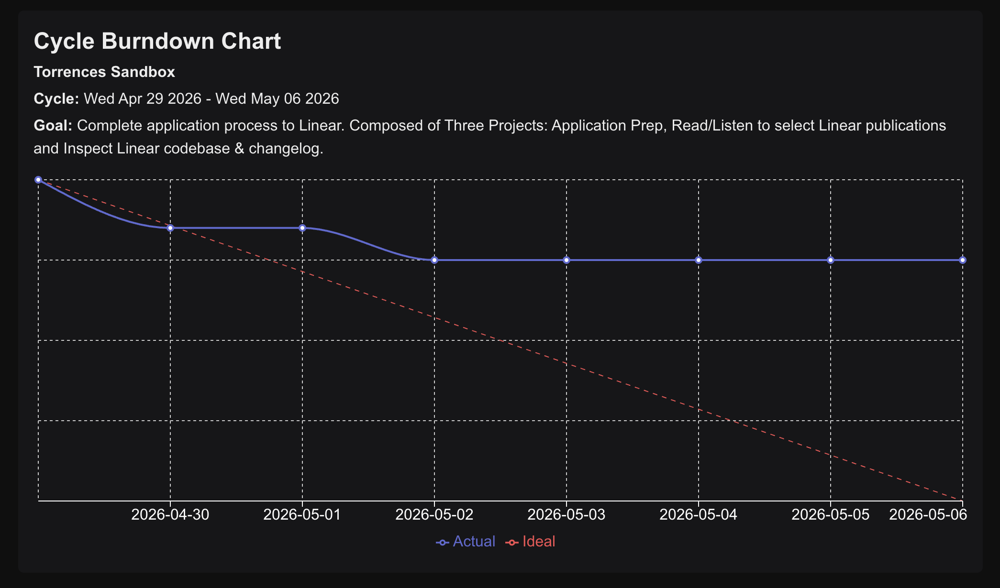

# Linear Cycle Burndown Demo

A small Next.js app that visualizes a cycle burndown for any Linear team using the Linear TypeScript SDK. Linear deliberately doesn't surface burndown charts in their UI — I wanted to learn their API by building one for my own active cycle.

The chart shows the sum of all issues assigned to the current cycle for a team. Typically each issue is assigned an "estimate" which is basically a unit of measurement for the difficulty. As a V1 for this project, 1 is assigned to each issue. The chart plots two lines: one that projects an "ideal" timeline for work to be completed and one that shows the "actual" work remaining from start to end of the cycle.

## Design Choices

1. For V1, assigned a value of 1 to each issue. For the next iteration, estimates will be assigned to issues for a more accurate snapshot.
2. Assigned Linear API Key to environment variable and stored in a .`env.local` file.
3. The chart only shows burndown for the current cycle. V2 will display a tabbed layout with the ability to view Burndown charts for all cycles.
4. "Completed" and "Canceled" issues are lumped into one but in the future, Canceled will be excluded from the total work.

## Prerequisites

1. If you haven't already, create a few issues in Linear and assign them to a cycle. To test the Burndown chart is working correctly, set one issue status to "completed".

## Getting Started

1. Clone this repo to your local machine:
   `git clone https://github.com/TorrenceB/linear-integration.git`

2. Once you have the repo, navigate to the root of the project and install dependencies:
   `npm install`

3. If you don't have a Linear API key yet, here's how to create one:
   1. Click on your team name in the upper left hand corner.
   2. Navigate to Settings => Security and Access.
   3. Under Personal API Keys section, click New API Key.
   4. Create a new API key, make sure to assign yourself full access under permissions.

4. Create a `.env.local` file in the root of the project. Add a new environment variable named `LINEAR_API_KEY`.

5. Assign your API key to `LINEAR_API_KEY`.

6. Finally run the development server:
   `npm run dev`

## Takeaways

1. For developers building against it, that pace makes the SDK's TypeScript types essential — they catch schema changes at compile time instead of in production.

2. Issue descriptions are optional in the data model, not just in the UI. That mirrors their 'Write Clearly and Directly' guidance in [Write Issues Not User Stories](https://linear.app/method/write-issues-not-user-stories) — that the title should carry the meaning and a description is something you add only if you need to. The product philosophy is encoded in the schema.

3. The mental model of the API maps directly to what they're referred to in the Linear Interface. There's no guessing game as to what the data for a specific attribute is named. For example:
   - Cycles are called "Cycle" in the Schema, not "Sprint".
   - Workflow types have a clearly defined set of values, e.g "triage", "backlog", "unstarted", etc. This makes it easy to write code against the definition rather than an arbitrary name you have to reference.

Linear's API isn't a thin wrapper around the database — it's a domain model that makes their methodology the path of least resistance.

## V2 and Beyond

1. Assign actual estimates to each issue. This will paint a more accurate picture of what Cycle progress looks like.
2. Separate "Completed" and "Canceled" statuses. Including canceled issues in burndown can cloud accuracy of the chart.
3. Improve UI to support viewing all team Cycles rather than the most current one.
4. Group the Burndown chart by project rather than joining all issues together.
